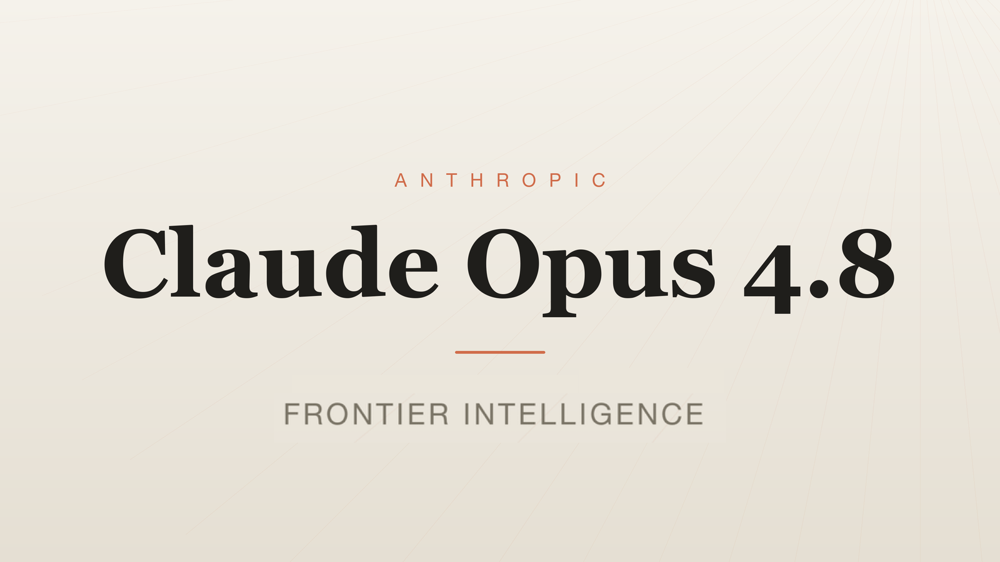

# opus-4.8-utilities

Small, runnable scripts that illustrate Claude **Opus 4.8** features on the Messages API (Python SDK). Each file is self-contained and prints what it demonstrates.

## Requirements

- Python 3.8+
- A recent Anthropic SDK: `pip install -U anthropic` (these were written against `0.105`)
- An API key in the environment: `export ANTHROPIC_API_KEY=sk-ant-...`

All scripts target the model `claude-opus-4-8`.

## Scripts

### `effort_demo.py` — effort as a dial, not a model choice

Runs the **same prompt on the same model** across all five effort levels (`low`, `medium`, `high`, `xhigh`, `max`) and prints token usage for each.

```bash
python3 effort_demo.py
```

Output tokens climb with effort — you turn the dial, you don't swap the model. `effort` lives inside `output_config`; `high` is the default; `xhigh` and `max` are Opus-tier only.

### `cache_safe_system_injection.py` — mid-conversation system messages without breaking the cache

Demonstrates injecting a new instruction mid-conversation as a `{"role": "system"}` entry in the `messages` array, leaving the top-level (cached) `system` untouched.

```bash
python3 cache_safe_system_injection.py
```

It prints three calls:

- **turn 1** — cold, writes the large system prefix to cache (`cache_write > 0`)
- **turn 2a** — injects a system entry in `messages` → cached prefix survives (`cache_read > 0`)
- **turn 2b** — the old way, folds the instruction into the top-level `system` → cache invalidated (`cache_write > 0`, `cache_read = 0`)

The 2a-vs-2b gap is the cost of cache invalidation on a long-running agent. Requires a Claude 4+ model.

## Note

These make live API calls and consume tokens. Keep `max_tokens` and effort modest while experimenting.
